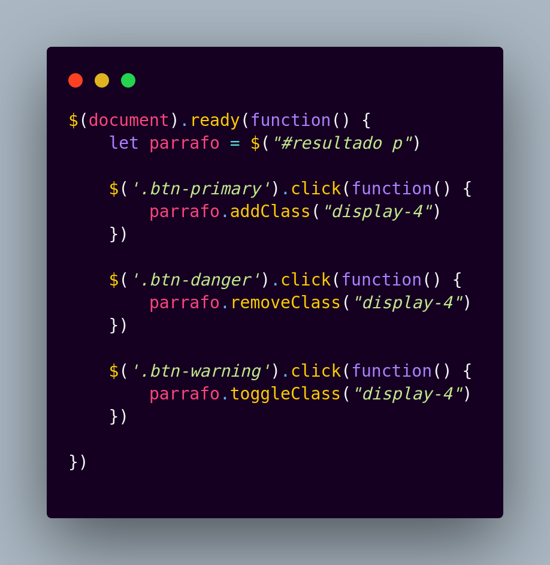

# Pequeñas funcionalidades con JQuery

###### Para empezar este pequeño proyecto creado con html, bootstrap y jquery se creo un archivo con extensión html, en el se adjuntoron los cdns de bootstrap6 y jquery3.6

_En el documento html se crearon 3 botones con algunas clases de bootstrap, primer boton "Agregar" que se le asigno la clase btn primary_

_Despues se crea el boton Quitar el cual tiene la clase btn danger y finalmente un tercer y ultimo boton con la clase warning que tiene la leyenda Toggle_

*nuestro siguiente paso sera crear un archivo con extension js en el cual se asignaran las funciones a cada boton con la libreria jquery*

